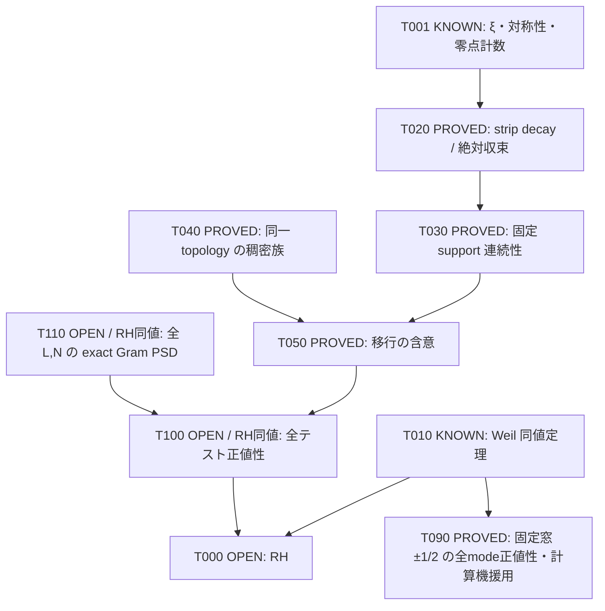

**STATUS: RIEMANN HYPOTHESIS OPEN**

> 公開用に整形した研究原資料の履歴snapshotです。本文の「現在」「完了」「PASS」は原記録の対象・時点に限定され、RH証明や公開環境での再実行を意味しません。
> Public credit: @ykbballer91 · AI-assisted research log · Text: CC BY 4.0.
> Source: `theorem_graph/graph.md` · Original SHA-256: `7bb525d46731cf22ff0cde2be1745910ba2ed4157287823baa48fa8c0bd35ed1`.
> 原資料パスと公開パスの対応・書換え・export hashは[公開source manifest](../../../data/source-manifest.json)を参照。本文のコード・検証ログは履歴であり、このexportでは再実行していません。

---

# 依存グラフ

RH は OPEN。採用した補助補題だけで RH へ到達する経路はない。

矢印はすべて依存条件がそろって初めて有効。T050 は含意を証明し、
T110 の全称前件を証明していない。グラフに循環依存を入れず、数学的な同値性を
ノードの属性として記す。証明済みノードだけをたどると T100 で必ず止まる。

独立な未解決核心は選択ルート上では1クラス（RH / Weil positivity / 全称 Gram PSD）。
これは RH 同値な主張に集約しただけであり、難度低下でも完成に近づいた証拠でもない。
未解決表示のノードは T000, T100, T110 の3つ。

## 三つの異なる移行

- 零点高さ cutoff T→∞: 固定 f,g に対する絶対収束。T020。
- 同じ窓の次元 N→∞: 形式の連続性と適切な稠密性。T030–T050。
- 全 support の網羅 L→∞: 任意 f の support を含む整数 L を選ぶ全称化。
  すべての L に対する正値性が必要。有限窓の実験からは得られない。

## 形式検証

Lean の対象は、pointwise limit・dense subset からの非負性移行の一般補題と
有限反例の代数部分。ζ、Weil criterion、積分評価、稠密 bump 族の全体は未形式化。
実際のコンパイル結果と axiom 出力だけを formal/lean/README.md に記録する。

## 反証した候補

F001–F004 は全て一般論の誤った短絡。RH 本体も、文献に存在する正しい
有限窓定理も反証していない。数値例と厳密な代数証明を区別する。

## 追加の監査対象

T060は実行済みLeanの8宣言。T070は既知核汎関数の最適値を再導出したPROVEDノード。
T070からF006の限定的候補を棄却した。いずれもT100の前件を証明しない。

T080は非負確率密度の補助的な平方完成恒等式。独立解析監査済みだが、
RHへの依存矢印は存在しない。既存の変分問題との対応を確認し、新規性は主張しない。未形式化。

T090はsupport[-1/2,1/2]に限定したQ_W≥9×10^(−8)||f||²の計算機援用証明。
有限headだけでなく無限tailと交差項を覆い、別実行・別Cholesky・解析監査を通過。
Weil形式の既知規約をT010から参照するが、RHを仮定しない。新規性は主張しない。
T090からT100/T110/RHへの矢印はない。局所の定数を大窓へ外挿できない。

---

**公開版の参照案内（編集注）**

本文中のsource-relative pathは原記録の識別子です。収録先:

- [`formal/lean/README.md`](../../../artifacts/formal/lean/README.md)
